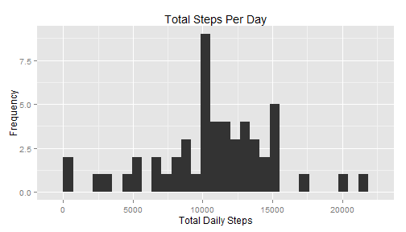
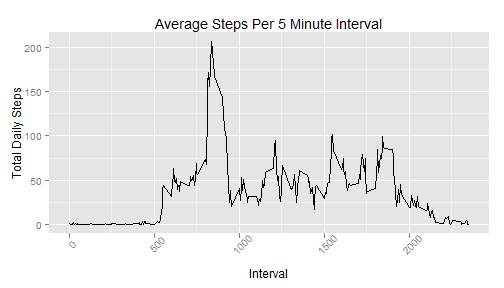
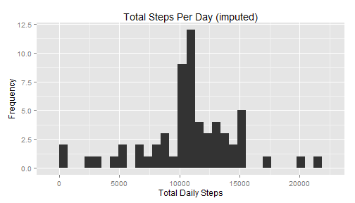
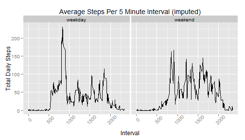

Reproducible Research - Course Project 1
========================================================

*All portions I've written or commented on are italicized*

## Load and preprocessing the data

1. Load the data  

    *I began by loading the libraries I needed for this work, setting the data to show the full value of data not scientific notation, setting the working directory and reading the data to the "rawData" data frame. I used camel case on my data frames, etc to assist in readability*
    
    
    ```r
    library(knitr)
    library(ggplot2)
    
    options(scipen = 1, digits = 3)
    
    setwd("~/Data Scientist Spec/Reproducible Research/Course Project 1")
    rawData <- read.csv("activity.csv")
    ```

2. Process/Transform the data (if necessary) into a format suitable for your analysis  

    *I "transformed" the date variable in rawData to ensure it is formatted as a date variable*
    
    
    ```r
    rawData$date <- as.Date(rawData$date,format="%Y-%m-%d")
    ```

## What is mean total number of steps taken per day?  

For this part of the assignment, you can ignore the missing values in the data set.  

1. Make a histogram of the total number of steps taken each day  

    *I began by creating an aggregate of the rawData based on the date variable and summing the steps variable. This new data frame was called stepsPerDayData. I renamed the columns to assist in coding and created a Histogram with default bin sizes in ggplot2. I chose to ignore the missing values for this graph.*

    
    ```r
    stepsPerDayData <- aggregate(rawData$steps,list(rawData$date),sum)
    colnames(stepsPerDayData) <- c("date","stepsPerDay")
    ggplot(stepsPerDayData,aes(stepsPerDay))+geom_histogram()+
        labs(title="Total Steps Per Day", x="Total Daily Steps", y="Frequency")
    ```
    
     

2. Calculate and report the mean and median total number of steps taken per day  

    *I first removed the missing cases of steps and then ran the mean and median functions. While I could leave the missing values for the histogram as it would ignore them, I had to remove them for the mean and meadian functions to run*
    
    ```r
    cleanData <- stepsPerDayData[complete.cases(stepsPerDayData),]
    meanSteps <- mean(cleanData$stepsPerDay)
    medianSteps <- median(cleanData$stepsPerDay)
    ```
    *The mean is*
    
    ```
    ## [1] 10766
    ```
    *and the median is* 
    
    ```
    ## [1] 10765
    ```

## What is the average daily activity pattern?  

1. Make a time series plot (i.e. type = "l") of the 5-minute interval (x-axis) and the average number of steps taken, averaged across all days (y-axis)

    *I first took the rawData set and removed the missing cases. I then aggregated the data by interval averaging the steps variable. I renamed the columns to assist in readability and plotted the results on a time-series graph with ggplot2. I kept each interval in terms of the original variables (0,5,10,etc.). (Note: With each step I try to begin with the RawData data frame when possible. This decreases the likelihood of propagating an error throughout the script.)*

    
    ```r
    cleanData <- rawData[complete.cases(rawData),]
    stepsPerIntervalData <- aggregate(cleanData$steps,list(cleanData$interval),mean)
    colnames(stepsPerIntervalData) <- c("interval","stepsPerDay")
    ggplot(stepsPerIntervalData,aes(x=interval, y=stepsPerDay))+geom_line()+
        theme(axis.text.x = element_text(angle=45))+
        labs(title="Average Steps Per 5 Minute Interval", x="Interval", y="Total Daily Steps")
    ```
    
     

2. Which 5-minute interval, on average across all the days in the data set, contains the maximum number of steps?  

    *I could look at the above graph to do this but I would rather be more accurate and ran a max function to determine the interval with max steps.*

    
    ```r
    maxInterval <- stepsPerIntervalData[which.max(stepsPerIntervalData$stepsPerDay),1]
    ```
    *The 5 minute interval with the max steps is*
    
    ```
    ## [1] 835
    ```

## Imputing missing values  

1. Calculate and report the total number of missing values in the data set (i.e. the total number of rows with As)  

    *To determine the number of missing cases I ran a summary function, saved it to a new variable and then returned the portion of the variable with the number of missing cases.*

    
    ```r
    countNA <- as.list(summary(rawData))
    countNA[[7]]
    ```
    
    ```
    ## [1] "NA's   :2304  "
    ```

2. Devise a strategy for filling in all of the missing values in the data set. The strategy does not need to be sophisticated. For example, you could use the mean/median for that day, or the mean for that 5-minute interval, etc.  

    *I will use the mean from the 5 minute interval. I did not use the mean from the day as there are points where an entire day is missing.*

3. Create a new data set that is equal to the original data set but with the missing data filled in.

    *I created a new data frame imputData based on the original rawData. I used a for loop to check the new data set for missing cases. When a missing case was found it was replaced with the average for that 5 minutes interval*

    
    ```r
    imputeData <- rawData
    for (i in 1:nrow(imputeData)){
        if (complete.cases(imputeData[i,]) == FALSE) {
            #Use the average for that 5 minute interval as the Day will be entirely missing
            imputeData[i,1] <- stepsPerIntervalData[which(imputeData[i,3] == stepsPerIntervalData$interval),2]
        }
    }
    ```

4. Make a histogram of the total number of steps taken each day and Calculate and report the mean and median total number of steps taken per day.  

    *I took the imputData from the previous step and aggregated it for each day and summed the steps. I then plotted this as a histogram with ggplot2. The mean and median were found for the aggregated data as before*

    
    ```r
    stepsPerDayImputeData <- aggregate(imputeData$steps,list(imputeData$date),sum)
    colnames(stepsPerDayImputeData) <- c("date","stepsPerDay")
    ggplot(stepsPerDayImputeData,aes(stepsPerDay))+geom_histogram()+
        labs(title="Total Steps Per Day (imputed)", x="Total Daily Steps", y="Frequency")
    ```
    
     
    
    ```r
    meanImputeSteps <- mean(stepsPerDayImputeData$stepsPerDay)
    medianImputeSteps <- median(stepsPerDayImputeData$stepsPerDay)
    ```
    *The mean is *
    
    ```
    ## [1] 10766
    ```
    *and the median is*
    
    ```
    ## [1] 10766
    ```
    Do these values (mean and median) differ from the estimates from the first part of the assignment?  
    
    *The values vary slightly but not significantly. The original mean (10766.189) and the imputed mean (10766.189) are the same. The original median (10765) is slightly lower than the imputed median (10766.189).*
    
    What is the impact of imputing missing data on the estimates of the total daily number of steps?  
    
    *You will notice a change in the histogram, as the frequency of average increases due to imputation. I added the average 5 minute interval for each missing interval and as days were completely missing this created additional average days. This is also the reason for the slight increase in median*

## Are there differences in activity patterns between weekdays and weekends?  

1. Create a new factor variable in the data set with two levels - "weekday" and "weekend" indicating whether a given date is a weekday or weekend day.

    *I took the imputedData set from previous steps and created a new variable. First I determined the weekday for the date variable and then assigned "weekday" or "weekend" to the new variable based on the weekday. Finally I converted the new variable to a factor.*

    
    ```r
    imputeData$dayType <- as.factor(ifelse(weekdays(imputeData$date)%in% c("Saturday","Sunday"),"weekend","weekday"))
    ```

2. Make a panel plot containing a time series plot (i.e. type = "l") of the 5-minute interval (x-axis) and the average number of steps taken, averaged across all weekday days or weekend days (y-axis). 

    *I took the data frame from the previous step and aggregated for the interval and dayType variables and average and averaged the steps variable. Next I renamed the columns in the new data set. Finally I make a 2 facet graph in ggplot2 to show the time series for each dayType option.*
    

    
    ```r
    stepsPerIntervalImputeData <- aggregate(imputeData$steps,list(imputeData$interval, imputeData$dayType),mean)
    colnames(stepsPerIntervalImputeData) <- c("interval","dayType","stepsPerDay")
    ggplot(stepsPerIntervalImputeData,aes(x=interval, y=stepsPerDay))+geom_line()+facet_grid(.~dayType)+
        theme(axis.text.x = element_text(angle=45))+
        labs(title="Average Steps Per 5 Minute Interval (imputed)", x="Interval", y="Total Daily Steps")
    ```
    
     
